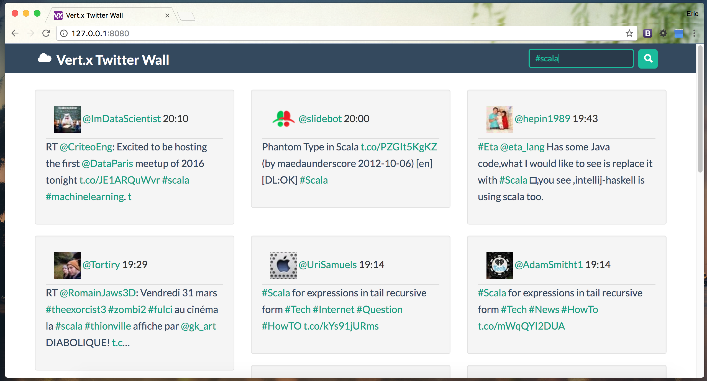

# Vert.x Twitter Wall

[](https://travis-ci.org/sczyh30/vertx-twitter-wall)

A simple Twitter Wall application written in Vert.x Scala.

## Build

To build the code and generate package:

```
sbt clean assembly
```

Before running the application, you need to put your Twitter OAuth credentials in the config file. 
Then you can run the application directly in terminal:

```
java -jar target/scala-2.12/vertx-twitter-wall-assembly-1.0.jar -conf project/config.json
```

Now you can visit the Twitter Wall in the browser:



## Configuration

You can put your config into a JSON file and provide the path when running the application.
Here are the configurations:

- `app.port`: the port of the application, by default **8080**
- `app.update.interval`: the interval of fetching the latest tweets
- `app.consumerKey`: your consumer key of Twitter API
- `app.consumerSecret`: your consumer secret key of Twitter API

## Credit

Some frontend architecture is inspired from [@yunyul](https://github.com/yunyul).
